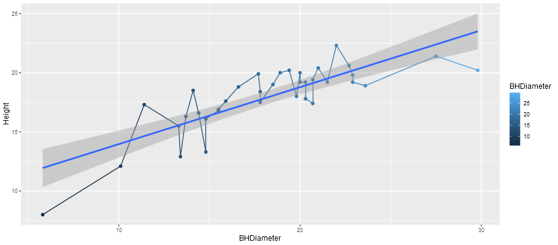
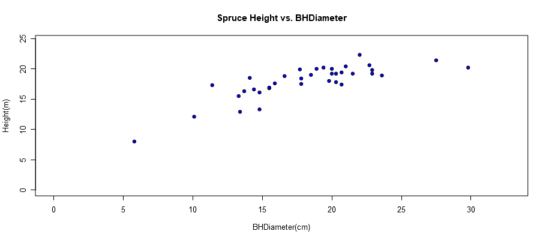
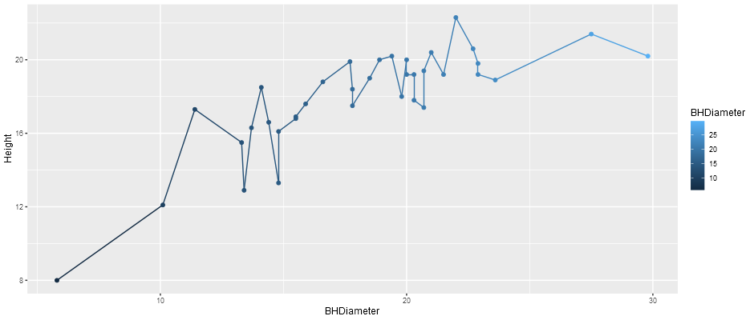

```{r setup, include=FALSE}
knitr::opts_chunk$set(echo = TRUE)
```

# Task 1

WD

```{r}
getwd()
```

# Task 2
## Get the head of "SPRUCE.csv"
```{r}
spruce.df = read.csv("SPRUCE.csv")
head(spruce.df)
```

# Task 3
##  a. Make a scatter plot.
```{r}
plot(spruce.df$BHDiameter, spruce.df$Height, main = "Spruce Height vs. BHDiameter",
     xlab = "BHDiameter(cm)", ylab = "Height(m)", pch = 21, bg = "Blue", cex = 1.2,
     ylim = c(0, 1.1 * max(spruce.df$Height)), xlim = c(0, 1.1 * max(spruce.df$BHDiameter)))

```

##  b. Straight line relationship? There seems to be an upward trend that curves and levels off.

##  c. Plot 3 trendscatter plots.
```{r}
library(s20x)
layout(matrix(1:3, nrow = 3, ncol = 1, byrow = T))
#layout.show(3)
trendscatter(Height~BHDiameter, f = .5 ,data = spruce.df)
trendscatter(Height~BHDiameter, f = .6 ,data = spruce.df)
trendscatter(Height~BHDiameter, f = .7 ,data = spruce.df)
```
  
##  d. Create the linear model
```{r}
spruce.lm = with(spruce.df, lm(Height~BHDiameter))
```
 
##  e. Plot the linear model on the scatter plot.
```{r}
plot(spruce.df$BHDiameter, spruce.df$Height, main = "Spruce Height vs. BHDiameter",
     xlab = "BHDiameter(cm)", ylab = "Height(m)", pch = 21, bg = "Blue", cex = 1.2,
     ylim = c(0, 1.1 * max(spruce.df$Height)), xlim = c(0, 1.1 * max(spruce.df$BHDiameter)))
abline(spruce.lm)
```
  
##  f. Straight vs. curved?
    A straight line does not capture the more general trend of the trees eventually leveling off after a certain height. A smooth curve would be more appropriate as it would fit the data set better.

# Task 4
##  a. Plot 4 graphs demonstrating the residual, model, and total sum of squares, i.e., RSS, MSS, TSS. 
```{r}
layout(matrix(1:4, nrow = 2, ncol = 2, byrow = T))
plot(spruce.df$BHDiameter, spruce.df$Height, 
     main = "Spruce Height vs. BHDiameter",
     xlab = "BHDiameter(cm)", ylab = "Height(m)", pch = 21, 
     bg = "Blue", cex = .8, ylim = c(0, 1.1 * max(spruce.df$Height)),
     xlim = c(0, 1.1 * max(spruce.df$BHDiameter)))
abline(spruce.lm)


plot(spruce.df$BHDiameter, spruce.df$Height, 
     main = "Spruce Height vs. BHDiameter",
     xlab = "BHDiameter(cm)", ylab = "Height(m)", pch = 21, 
     bg = "Blue", cex = .8, ylim = c(0, 1.1 * max(spruce.df$Height)), 
     xlim = c(0, 1.1 * max(spruce.df$BHDiameter)))
abline(spruce.lm)
yhat = with(spruce.df, predict(spruce.lm, data.frame(BHDiameter)))
with(spruce.df,{
segments(BHDiameter,Height,BHDiameter,yhat)
})


plot(spruce.df$BHDiameter, spruce.df$Height, 
     main = "Spruce Height vs. BHDiameter",
     xlab = "BHDiameter(cm)", ylab = "Height(m)", pch = 21, 
     bg = "Blue", cex = .8, ylim = c(0, 1.1 * max(spruce.df$Height)), 
     xlim = c(0, 1.1 * max(spruce.df$BHDiameter)))
abline(spruce.lm)
with(spruce.df,abline(h=mean(Height)))
with(spruce.df, segments(BHDiameter,mean(Height),BHDiameter,yhat,col="Red"))


plot(spruce.df$BHDiameter, spruce.df$Height, 
     main = "Spruce Height vs. BHDiameter",
     xlab = "BHDiameter(cm)", ylab = "Height(m)", pch = 21, 
     bg = "Blue", cex = .8, ylim = c(0, 1.1 * max(spruce.df$Height)), 
     xlim = c(0, 1.1 * max(spruce.df$BHDiameter)))
with(spruce.df,abline(h=mean(Height)))
with(spruce.df, segments(BHDiameter,Height,BHDiameter,mean(Height),col = "Green"))

```

##  b. Calculate RSS, MSS, TSS. 
$$RSS,MSS,TSS$$
```{r}
RSS = with(spruce.df, sum((Height - yhat)^2))
RSS

MSS = with(spruce.df, sum((yhat - mean(Height))^2))
MSS

TSS = with(spruce.df, sum((Height - mean(Height))^2))
TSS
```

## c. The MSS/TSS describes how well the regression line fits with the data. MSS/TSS is roughly 66%.
$$\frac{MSS}{TSS}$$
```{r}
MSS/TSS
```

## d. TSS = RSS + MSS?
Yes they do in fact equal each other.
```{r}
testTSS = RSS + MSS
testTSS
TSS
```


# Task 5
##  a. Summary of spruce.lm
```{r}
summary(spruce.lm)
```
##  b. The value of slope is .48147
```{r}
coef(spruce.lm)
```

##  c. The value of intercept is 9.14684
##  d. Height = 9.14684 + .48147 * BHDiameter
##  e. Predict the height for trees when diameter is 15, 18, and 20 cm.
```{r}
predict(spruce.lm, data.frame(BHDiameter = c(15, 18, 20)))
```
The height will be 16.36895, 17.81338, 18.77632 m respectively, given spruce.lm.

# Task 6
```{r}
library(ggplot2)
g = ggplot(spruce.df, aes(x = BHDiameter, y = Height, color = BHDiameter))
g = g + geom_point() + geom_line() +geom_smooth(method = "lm")
g + ggtitle("Height VS BHDiameter")
```


# Task 7

<center>
{ width=70% }
</center>

<center>
{ width=70% }
</center>

<center>
{ width=70% }
</center>

