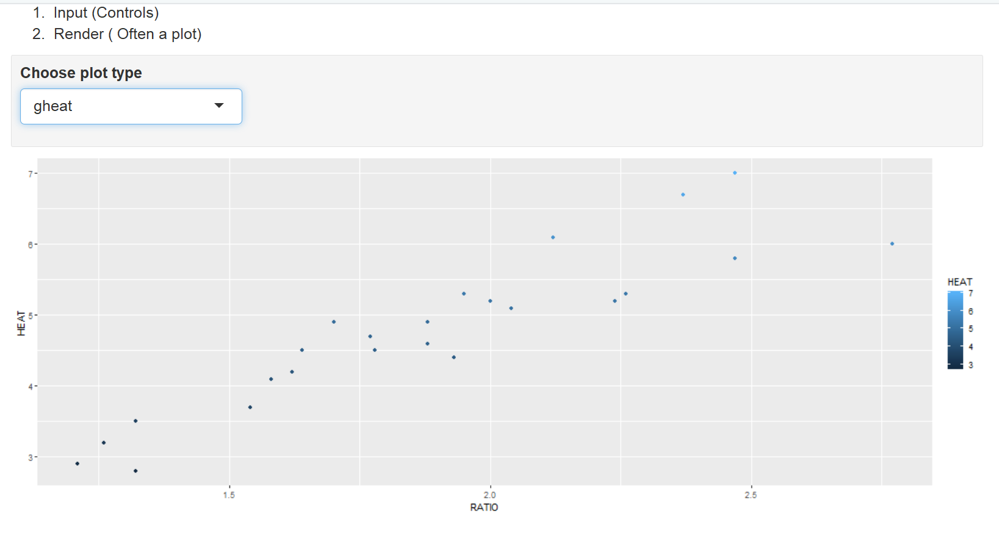

```{r setup, include=FALSE}
knitr::opts_chunk$set(echo = TRUE)
```

# Task 1

WD

```{r}
getwd()
```

# Task 2

```{r}
spruce.df = read.csv("SPRUCE.csv")
head(spruce.df)
```

# Task 3
  a.
```{r}
plot(spruce.df$BHDiameter, spruce.df$Height, main = "Spruce Height vs. BHDiameter",
     xlab = "BHDiameter(cm)", ylab = "Height(m)", pch = 21, bg = "Blue", cex = 1.2,
     ylim = c(0, 1.1 * max(spruce.df$Height)), xlim = c(0, 1.1 * max(spruce.df$BHDiameter)))

```

  b.straight line relationship? More curved not straight

  c.
```{r}
library(s20x)
layout(matrix(1:3, nrow = 3, ncol = 1, byrow = T))
#layout.show(3)
trendscatter(Height~BHDiameter, f = .5 ,data = spruce.df)
trendscatter(Height~BHDiameter, f = .6 ,data = spruce.df)
trendscatter(Height~BHDiameter, f = .7 ,data = spruce.df)
```
  
  d.
```{r}
spruce.lm = with(spruce.df, lm(Height~BHDiameter))
```
 
  e.
```{r}
#layout(matrix(1:1, nrow = 1, ncol = 1, byrow = T))
#layout.show(1)
plot(spruce.df$BHDiameter, spruce.df$Height, main = "Spruce Height vs. BHDiameter",
     xlab = "BHDiameter(cm)", ylab = "Height(m)", pch = 21, bg = "Blue", cex = 1.2,
     ylim = c(0, 1.1 * max(spruce.df$Height)), xlim = c(0, 1.1 * max(spruce.df$BHDiameter)))
abline(spruce.lm)
```
  
  f.
  g. A straight line does not capture the more general trend of the trees eventually leveling off after a certain height. A smooth curve would be more appropriate as it would fit the data set better.

# Task 4
```{r}
layout(matrix(1:4, nrow = 2, ncol = 2, byrow = T))
#layout.show(4)
plot(spruce.df$BHDiameter, spruce.df$Height, main = "Spruce Height vs. BHDiameter",
     xlab = "BHDiameter(cm)", ylab = "Height(m)", pch = 21, bg = "Blue", cex = 1.2,
     ylim = c(0, 1.1 * max(spruce.df$Height)), xlim = c(0, 1.1 * max(spruce.df$BHDiameter)))
abline(spruce.lm)
```
# Me

```{r}
obj = lm(Height~BHDiameter, data = spruce.df)
summary(obj)
plot(Height~BHDiameter, data = spruce.df)
abline(obj)
library(s20x)
trendscatter(Height~BHDiameter,f=0.7, data=spruce.df)
```


#Task 7
This is how you place images in RMD documents

<center>
{ width=70% }
</center>


