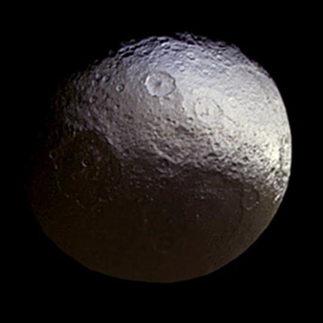
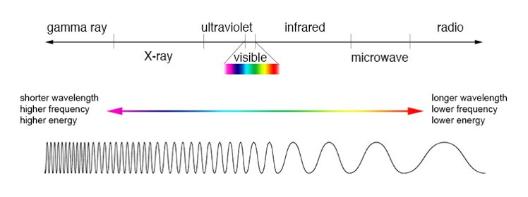

<center>

 { width=20% }

</center>


```{r setup, include=FALSE}
knitr::opts_chunk$set(echo = TRUE)
library(leaflet)
library(dplyr)
```

# My Video

<video width="320" height="240" controls>
  <source src="movie.fbr" type="video/fbr">
Your browser does not support the video tag.
</video>


# Introduction

Saturn has many moons, and one of the most peculiar Saturnian moon, if not the most peculiar moon in our whole solar system, is Iapetus. Iapetus has two distinct regions, a bright side, and a dark side, with an equatorial ridge going 75% of the way around the moon (@wikipedia_2021).

<center>

  of Iapetus"){ width=50% }

</center>

Iapetus was discovered in 1671 by Giovanni Cassini, and he also discovered the two different regions on Iapetus when he found that sometimes the moon would be brighter at some points and significantly duller at other points in its' orbit (@wikipedia_2021). He hypothesized that the moon should have one bright reflective region, and one dull or dim region on the other side. This color dichotomy represents an almost yin yang relationship between the two halves.

<center>

 { width=50% }

</center>

What I wish to explore is to see if Iapetus's color change is gradual or abrupt between the regions. We will also explore if we can predict the ratio of UV to green given the ratio of IR to green. 

Ultraviolet (UV) and infrared (IR) spectrometers were used to measure the ratios of UV to green, and IR to green (@buratti_mosher). The wavelengths of UV are smaller as they are energetic on the spectrum, while the wavelengths of IR are bigger or longer on the spectrum. Both of the measures meet in the middle, they meet at green in the visible spectrum.


<center>

 { width=100% }

</center>

## Data 

The Cassini-Huygens spacecraft reached Saturn in July of 2004, where the probe Huygens landed on Titan, one of Saturn's moons, and Cassini began orbiting around Saturn and its' moons (@nasa_2019). The Cassini orbiter measured different zones on Iapetus with UV and IR spectrometers to understand the composition of the moon as well as the brightness, and what color the moon is giving off. The UV filter was set to 338nm (nanometers), the IR filter was set to 930nm, and the green filter was set to 568nm, where 568nm is almost in the yellow spectrum of visible light (@greicius_2017).

```{r data}
iapetus=read.csv("SATMOON.csv")
head(iapetus)
paste0("UV/Green = ", round(338/568,4))
paste0("IR/Green = ", round(930/568,4))
```
## Interest in the data

Space is extremely vast and has an infinite amount of interesting things. This data set drew me in and I learned a lot of different things about the moon Iapetus and its' unique structure among the moons in our solar system. I want to explore to see if there is a relationship between the ratios of the spectrums of electromagnetic frequency. 

## Initial graphs for linearity and correlation between UV.Green and IR.Green

```{r Trend Scatter}
library(s20x)
trendscatter(UV.Green~IR.Green,data = iapetus,f = .5)
pairs20x(iapetus[,2:3])
with(iapetus,cor(UV.Green,IR.Green))
with(iapetus,cor(UV.Green,IR.Green)^2)
```

We can see on the trendscatter plot that UV/Green versus IR/Green seems to have a linear relationship with a negative slope with a slight crease near the middle. 

We can also see how the pairs of UV/Green and IR/Green has a .96 correlation coefficient or r. In fact the correlation is actually -.9551. This value shows that as IR/Green increases, UV/Green decreases and vice versa as we have a negative correlation. Just because we have a high correlation does not mean that an IR/Green value causes an UV/Green value, but I think we can say this specifically about Iapetus where the data was collected.

If we square our correlation we will get our correlation of determination or r^2, which explains the variability of y or UV/Green that can be explained by the linear model. So we can see that 91.22% of the variation of UV/Green can be explained by our model. We will get more into this later and see if we can increase this.

# Theory

## Independent and Dependent variables

For the independent variable, I chose IR/Green (x), and for the dependent variable, I chose UV/Green(y). I want to see if IR/Green can predict UV/Green, since we can see that as IR/Green decreases, UV/Green increases.

## Model

For the SLR, we will need to determine a model, and since we saw earlier when graphing our trendscatter plot, we saw that not all points fell on the linear line, so we might want to instead opt for the probabilistic model where we have some variation around our data points. If the model is good, that is if R^2 is close to 1, then most of the variability will be explained by our probabilistic model.

### Linear Model

SLR makes the straight line on the graph by taking our mean y value, so mean of UV/Green from a given value of x or IR/Green, and any points that do not fall onto this line will be our random error.

$$y=\beta_0+\beta_1x+\epsilon$$

The $\epsilon$ is our random error or how far an individual point is away from our linear equation vertically. The $\beta_0$ is the y-intercept, and $\beta_1$ is the slope of the line, and both of these parameters are unknown. The $\beta$ factors on the linear line make up the deterministic part of the model, while $\epsilon$ makes up the probabilistic part of the model, that is why SLR is known as a probabilistic model.

Since we want the line that will give us the best estimates, then we want our $\epsilon$ values to have a mean equal to 0. This is to ensure that error component is uniform throughout the graph, so same amount of distance above the line and below the line for every datum. 

### Assumptions for SLR

$$\epsilon_i\sim N(0,\sigma^2)$$

#### Assumption 1

The mean value of random error $\epsilon$ has to equal 0, thus making the mean value of y, or UV/Green, $E(y)=\beta_0+\beta_1x$, notice that there is no $\epsilon$ in the equation since it is 0.

#### Assumption 2

The variance of random error $\epsilon$ is constant for all values of x, or IR/Green.

#### Assumption 3

$\epsilon$ is distributed normally.

#### Assumption 4

Every error observed is independent of those that come before or after, so no one effects the other.

# SLR Linear

## Plot

```{r Scatter Plot}
plot(iapetus$IR.Green,iapetus$UV.Green, main = "UV.Green vs. IR.Green",
     xlab = "IR.Green", ylab = "UV.Green", pch = 21, bg = "Blue", cex = 1.2,
     ylim = c(.6, 1.1 * max(iapetus$UV.Green)), xlim = c(.9, 1.1 * max(iapetus$IR.Green)))
```

This plot is what we will use to analyze some of our data.

## Linear model

```{r Linear Model}
iapetus.lm = with(iapetus, lm(UV.Green~IR.Green))
summary(iapetus.lm)
```

In our linear model, we can see that UV/Green is our y value, and IR/Green is our x value. This model gives us our estimates of the $\beta$, which are $\hat\beta_0=1.52915$ and $\hat\beta_1=-.58737$.

The multiple $R^2$ is 91.22%, which means that 91.22% of the variability of UV/Green is explained by the model.

```{r}
qt(1-.05/2,22)
```

In this summary we can also see that our t values for $\hat\beta_0=30.91$, and $\hat\beta_1=-15.12$ lies in the rejection region. So we can say that we reject the null hypothesis for $H_0:\beta_0=0$ and $H_0:\beta_1=0$ as both estimates t values lie in the rejection region. The same for the p-values being less than .05, so we would still reject the nulls. The null hypothesis basically is trying to say whether UV/Green has a relationship with IR/Green. Since the null basically says no effect, but we rejected the null, so UV/Green does have a relationship with IR/Green.

## Confidence Interval for the linear model

```{r}
ciReg(iapetus.lm,conf.level = .95)
```

Here we can see where our acceptance region is. In other words, we see that the y-intercept's acceptance region is (1.42656, 1.63175) and we would reject values outside of this region. Same with our slope, with the acceptance region being (-0.66795, -0.50679). These are just estimates that we are 95% confident with, they are not fact.

# Verifying Assumptions Linear

To see if a linear model will be the best fit, the best way to do that is to graph it.

```{r Scatter Plot, LM}
plot(iapetus$IR.Green,iapetus$UV.Green, main = "UV.Green vs. IR.Green",
     xlab = "IR.Green", ylab = "UV.Green", pch = 21, bg = "Blue", cex = 1.2,
     ylim = c(.6, 1.1 * max(iapetus$UV.Green)), xlim = c(.9, 1.1 * max(iapetus$IR.Green)))
abline(iapetus.lm)
```

We can see that model does mimic the general trend of the data pretty well.

## Residual Sum of Squares

```{r RSS}
plot(iapetus$IR.Green,iapetus$UV.Green, main = "UV.Green vs. IR.Green Residuals",
     xlab = "IR.Green", ylab = "UV.Green", pch = 21, bg = "Blue", cex = 1.2,
     ylim = c(.6, 1.1 * max(iapetus$UV.Green)), xlim = c(.9, 1.1 * max(iapetus$IR.Green)))
abline(iapetus.lm)
yhat = with(iapetus, predict(iapetus.lm, data.frame(IR.Green)))
with(iapetus,{
segments(IR.Green,UV.Green,IR.Green,yhat)
})
```

Here we can see the RSS lines plotted both above and below the linear model. The mean of these residuals should equal 0, thus explaining why this is the best fit graph, or if we can do better.

## Model Sum of Squares

```{r MSS}
plot(iapetus$IR.Green,iapetus$UV.Green, main = "UV.Green vs. IR.Green Model",
     xlab = "IR.Green", ylab = "UV.Green", pch = 21, bg = "Blue", cex = 1.2,
     ylim = c(.6, 1.1 * max(iapetus$UV.Green)), xlim = c(.9, 1.1 * max(iapetus$IR.Green)))
abline(iapetus.lm)
with(iapetus,abline(h=mean(UV.Green)))
with(iapetus, segments(IR.Green,mean(UV.Green),IR.Green,yhat,col="Red"))
```

At each data point, we can see that the MSS line segments start at the mean of UV/Green and go to the linear model at each datum, thus showing how well the model fits without the random error, or residuals. Thus implying that MSS+RSS will equal the total sum of squares.

## Total Sum of Squares

```{r TSS}
plot(iapetus$IR.Green,iapetus$UV.Green, main = "UV.Green vs. IR.Green Total",
     xlab = "IR.Green", ylab = "UV.Green", pch = 21, bg = "Blue", cex = 1.2,
     ylim = c(.6, 1.1 * max(iapetus$UV.Green)), xlim = c(.9, 1.1 * max(iapetus$IR.Green)))
with(iapetus,abline(h=mean(UV.Green)))
with(iapetus, segments(IR.Green,UV.Green,IR.Green,mean(UV.Green),col = "Green"))

```

This model, we ditch the linear model and show how much each datum deviates away from the mean, UV/Green.

## RSS, MSS, TSS

```{r}
RSS = with(iapetus, sum((UV.Green - yhat)^2))
RSS
paste0("Mean of residuals = ", with(iapetus, round(mean((UV.Green - yhat)^2)),4))
```

This is our residual sum of .0241, which has a mean of 0.

```{r}
MSS = with(iapetus, sum((yhat - mean(UV.Green))^2))
MSS
```
```{r}
TSS = with(iapetus, sum((UV.Green - mean(UV.Green))^2))
TSS
```
```{r}
RSS+MSS
```

Since the total sum of squares is just MSS plus RSS, then these two values should be equal, which they are.

```{r}
MSS/TSS
```

I showed the coefficient of determination earlier as being 91.22%, and here we calculated the result not using the "cor()" method, but calculating the formula straight up. An $R^2$ value that is 0 shows no correlation, and 1 shows the best correlation, so the coefficient of determination, or $R^2$ lies between $0\leq R^2\leq 1$. Here we have 91.22% of the variation of UV/Green being explained by the model. Thus this model could be a contender, unless there is a better model to explain the data.

## Alternative way of graphing the Linear model

```{r LM alt}
coef(iapetus.lm)
linear.fun=function(x){
  1.529154-.5873702*x
}
plot(iapetus$IR.Green,iapetus$UV.Green, main = "UV.Green vs. IR.Green",
     xlab = "IR.Green", ylab = "UV.Green", pch = 21, bg = "Blue", cex = 1.2,
     ylim = c(.6, 1.1 * max(iapetus$UV.Green)), xlim = c(.9, 1.1 * max(iapetus$IR.Green)))
curve(linear.fun, lwd = 2, col = "steelblue", add = T)
```

Here we see an alternative way to graph the linear model using the coefficients and creating a linear model in slope intercept format and adding that to the plot. We will use this same technique later for a quadratic.

## Trendscatter of UV/Green versus IR/Green

```{r}
trendscatter(UV.Green~IR.Green,data = iapetus,f = .5)
```

We saw this trendscatter plot at the beginning, but let us explain it further. Here we can see the general trend of the line in blue representing an almost linear relationship, or maybe slightly curved. The red dashed lines represent the one standard deviation error bounds. In other words, many different blue lines can be graphed within the red region, and the blue line that we see is the best fit out of all of those lines that could be there.

## Find Residuals
```{r}
uv.res = residuals(iapetus.lm)
```

## Find Fitted
```{r}
uv.fit = fitted(iapetus.lm)
```

## Plot Residuals vs. Fitted
```{r}
plot(uv.res~iapetus$IR.Green,ylab = "Residuals",xlab= "IR/Green",main="Residuals vs. IR/Green")
with(iapetus.lm,abline(h=mean(residuals(iapetus.lm))))
with(iapetus.lm, segments(iapetus$IR.Green,residuals(iapetus.lm),iapetus$IR.Green,mean(residuals(iapetus.lm)),col = "Green"))
```

Here we can see the residuals plotted against the IR to green ratio and as we can see, the graph looks as though it curves, it is not an even distribution about 0.

```{r}
trendscatter(uv.fit,uv.res,xlab = "Fitted",ylab = "Residuals")
```

Here we can see the results more clearly when we plot the residuals vs the fitted. It is quite clear that our linear model might not have been the best fit as we can see concavity or a curve (parabola). A quadratic might be more appropriate for our needs.

```{r}
plot(iapetus.lm,which = 1)
```

Here we see the same result, but using a different method.

## Normality

```{r}
normcheck(iapetus.lm,shapiro.wilk = T)
```

The p-value for our linear model is greater than .05, and since .924 is greater than .05, then we do not reject the null hypothesis that our data is normally distributed.

```{r}
round(mean(uv.res),digits = 4)
round(sum(uv.res),digits = 4)
```

# Quadratic model

The quadratic model is of the form $y=\beta_0+\beta_1x+\beta_2x^2$. This model graphs a best fit parabola on the data set.

```{r}
quad.lm <- lm(UV.Green~IR.Green + I(IR.Green^2),data = iapetus)
```

```{r}
coef(quad.lm)
curve.quad=function(x){
  2.4822086-2.1173829*x+0.6025148*x^2
}
plot(iapetus$IR.Green,iapetus$UV.Green, main = "UV.Green vs. IR.Green",
     xlab = "IR.Green", ylab = "UV.Green", pch = 21, bg = "Blue", cex = 1.2,
     ylim = c(.6, 1.1 * max(iapetus$UV.Green)), xlim = c(.9, 1.1 * max(iapetus$IR.Green)))
curve(curve.quad, lwd = 2, col = "steelblue", add = T)
```

This quadratic seems to capture how the data seems to naturally curve and flatten out near the Cassini Regio. So UV/Green should still decrease as IR/Green increases toward infinity. It is quite clear that this quadratic which our residuals vs fitted said would most likely be better fit for the data. If we graph the residuals vs fitted for the quadratic, we should expect to see a straight line about the residual mean.

## Quadratic equation

$$y=2.4822086-2.1173829*x+0.6025148*x^2$$

## Plot Residuals vs. Fitted
```{r}
plot(quad.lm,which = 1)
```

The quadratic model does straddle around 0 very closely, so this model, while not perfect, might be good enough. Since we can see possible outliers on this graph, we should measure 9, 13, and 22 to see if they are actual outliers and remove them.

## Normality of quadratic

```{r}
normcheck(quad.lm,shapiro.wilk = T)
```

We see a similar result to the linear function. We see that we should not reject the null hypothesis as our p-value of .631 is greater than .05. So we do not reject that the data is distributed normally.

## Quadratic Summary

```{r}
summary(quad.lm)
```

AS we see, our multiple $R^2$ is 93.77% which is greater than our linear model of 91.22%.

```{r}
qt(1-.05/2,21)
```

All of our estimates have a t statistic falling in the rejection region, as in $7.583>2.0796,-4.056<-2.0796,2.937>2.0796$, since all of our t statistics are in the rejection region then we reject the null. The null for $\beta_0=0,\beta_1=0,\beta_2=0$, and since we reject these nulls, then we have a relationship between these three coefficients. We can also reject our null since the p-values for these coefficients are all less than .05.

## 95% ci for estimates of quadratic

```{r}
ciReg(quad.lm)
```

These are the values that each of our coefficients can range from for our quadratic with 95% confidence in these values.

## Predictions of the models

Here we will predict what ratio of UV/Green we will get given values of IR/Green. We will test several points and compare.

```{r}
l.pred=predict(iapetus.lm, data.frame(IR.Green = c(2,1.52,1.21,1,.5)))
l.pred
mean(l.pred)
```
```{r}
q.pred=predict(quad.lm, data.frame(IR.Green = c(2,1.52,1.21,1,.5)))
q.pred
mean(q.pred)
```

We have shown here in descending order that as IR/Green ranges from 2 to .5 we should see that as IR/Green decreases, UV/Green increases. The values we see are relatively close to each other, but the larger values come from our quadratic model, as we can see by the means of our predictions. Does larger values necessarily mean that our quadratic will be the best fit? I believe that we still need to look at more measures to make a good determination of what model we should choose.

## Comparison of R squared values

$$\text{Linear Model: Multiple R-squared:  0.9122,	Adjusted R-squared:  0.9082} \\
\text{Quadratic Model: Multiple R-squared:  0.9377,	Adjusted R-squared:  0.9318} $$

While both of the $R^2$ values for our multiple $R^2$ are pretty high, we can see that the Linear model only explains 91.22% of the variability of UV/Green given the model, while the quadratic explains more, so a quadratic is the better fit for our regression. The adjusted $R^2$ adds more predictors to the model, and is able to adjust values if we have a chance correlation, thus decreasing the value of $R^2$. The two adjusted models still show that the quadratic explains more, and so the quadratic is our best fit model.

# Anova for our models

```{r}
anova(iapetus.lm,quad.lm)
```

The analysis of variance between the two models shows that the smaller residual sum of squares is the quadratic model. Why do we want smaller RSS values? These small values indicate that the datum are closer to the modeled line that we are analyzing. Thus, the quadratic is the better fit. The p-value indicates that there is a significant difference between the models, since if our p-value was close to 1, we would see the models closely resembling each other. Since this value is so low, then we can assume that the models look different on our plots.

# Cook's Distance

We can determine specific values as having more influence on a data set by measuring Cook's distance on the data. This analysis gives us possible influencers or outliers, that if removed, might improve our $R^2$ values. However, if we remove to many, then our $R^2$ value can decrease, so we should only remove what what's reasonable.

```{r}
cooks20x(quad.lm)
```

Since we can see that possible outliers lie at 13, 22, and 24, then we should remove the largest one to see if the $R^2$ values change. We will only remove 22 from our quadratic model to see what happens.

## Remove 22

```{r}
quad2.lm=lm(UV.Green~IR.Green + I(IR.Green^2),data = iapetus[-22,])
summary(quad2.lm)
summary(quad.lm)
```

Here we see that removing the data point 22 actually increases our multiple $R^2$ value from 93.77% to 93.83%, which is .06% higher, but this is a very small improvement. We can also see that our error for the estimates has increased when we removed 22. Since the $R^2$ value is better, then we will choose the quadratic model with data point 22 missing, thus making this model the best fit for our data. 

# Gradual

Here we will sidetrack a bit and talk about the different regions of Iapetus and how their colors and brightness relate to each other between zones.

```{r ggplot}
library(ggplot2)
g = ggplot(iapetus, aes(x = IR.Green, y = UV.Green, color = IR.Green,fill = Region))
g = g + geom_point() + geom_line() +geom_smooth(method = "lm")
g + ggtitle("UV.Green vs. IR.Green")
```

Here we can see the four regions that were measured as a part of the Cassini mission. In the textbook, they mention that the south pole is a "flat spectrum," and we can see that here in this plot (@mendenhall_sincich_2016). The south pole of Iapetus seems to have a uniform distribution. Similarly the Cassini Regio has a similar distribution of data. The Cassini Regio has the greatest IR to green ratio, as in the IR values are getting larger thus we start skewing away from green and into the red spectrum.

We can also see from this graph that the bright terrain is not uniform, but transitions. This could be simply an effect of where these measurements were actually taken in relation to each other. It is possible that these measurements could have significant distances between them. However, if these distances are relatively short, then we can say that the bright region begins and transitions from the flat South pole to Cassini Regio, the dark with the bright terrain and transition zone in between. We can see that this process of traversing between these regions is in fact a gradual and not abrupt color transition.

```{r}
g = ggplot(iapetus, aes(x = IR.Green, y = UV.Green, color = IR.Green))
g = g + geom_point() + geom_line() +geom_smooth(method = "lm")
g + ggtitle("UV.Green vs. IR.Green")
```

# Research Question

On this project I set out to try to understand the moon Iapetus and how the color dichotomy is transitions between regions, and to see if there was a significant relationship between the ratios of two wavelengths, UV/Green and IR/Green, and if there was a relationship, would it be better to use a linear model for our regression, or would a quadratic model better suit our need.


We can see that a quadratic relationship formed between UV/Green and IR/Green, where as IR/Green increases, then UV/Green decreases. We got slightly better accuracy when we removed one outlying data point, so that was the model we chose. If correlation does equal causation in this case, then we can reasonably say that with our model in hand, that we could predict how UV/Green would react if we increase or decrease the ratio of IR/Green.

# Suggestions

This was a bit of a difficult data set to work with as dealing with ratios of wavelengths was hard to get my mind around. However, learning from this has made me better at researching and finding meaning in these data sets. The way I think it could have been improved was if I could have seen exactly where each one of these measurements took place. This obscurity made it difficult to envision how close each of these measurements are actually from each other. The distance could be vast or small between points.

More measurements could make this analysis even better and suggest a better overall trend. However, with the data that I have, I can reasonably say that a quadratic fits the data. Two of the zones only had 4 data points while the other two zones had eight.

# References
