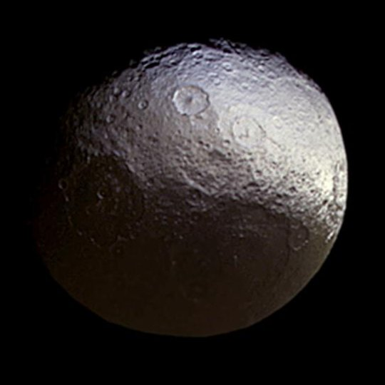

```{r setup, include=FALSE}
knitr::opts_chunk$set(echo = FALSE)
```

## Introduction

<center>

 { width=20% }

</center>

- Discovered in 1671 by Giovanni Cassini
- Has a unique color dichotomy
- Ridge
- Explore the relationship between the regions
- See if there is a SLR

## Data

```{r data}
iapetus=read.csv("SATMOON.csv")
head(iapetus)
paste0("UV/Green = ", round(338/568,4))
paste0("IR/Green = ", round(930/568,4))
```

## Initial Graphs

```{r Trend Scatter}
library(s20x)
trendscatter(UV.Green~IR.Green,data = iapetus,f = .5)
```

## Initial Graphs

```{r}
pairs20x(iapetus[,2:3])
paste0("Correlation: ",round(with(iapetus,cor(UV.Green,IR.Green)),4)," Determination: ",round(with(iapetus,cor(UV.Green,IR.Green)^2),4))
```


## Theory

- Independent Variable IR/Green
- Dependent Variable UV/Green
- Probabilistic vs Deterministic
- What sort of trend did we observe?
- $0\leq R^2\leq 1$
- $y=\beta_0+\beta_1x+\epsilon$

## Assumptions

$$\epsilon_i\sim N(0,\sigma^2)$$

- 1: Mean of $\epsilon=0$
- 2: Variance of $\epsilon$ is constant for the model
- 3: Distributed Normally
- 4: Independent errors

## SLR Linear

```{r Linear Model}
iapetus.lm = with(iapetus, lm(UV.Green~IR.Green))
summary(iapetus.lm)
```

## Verifying Assumptions

```{r}
layout(matrix(1:4, nrow = 2, ncol = 2, byrow = T))
plot(iapetus$IR.Green,iapetus$UV.Green, main = "UV.Green vs. IR.Green",
     xlab = "IR.Green", ylab = "UV.Green", pch = 21, bg = "Blue", cex = 1.2,
     ylim = c(.6, 1.1 * max(iapetus$UV.Green)), xlim = c(.9, 1.1 * max(iapetus$IR.Green)))
abline(iapetus.lm)
plot(iapetus$IR.Green,iapetus$UV.Green, main = "UV.Green vs. IR.Green Residuals",
     xlab = "IR.Green", ylab = "UV.Green", pch = 21, bg = "Blue", cex = 1.2,
     ylim = c(.6, 1.1 * max(iapetus$UV.Green)), xlim = c(.9, 1.1 * max(iapetus$IR.Green)))
abline(iapetus.lm)
yhat = with(iapetus, predict(iapetus.lm, data.frame(IR.Green)))
with(iapetus,{
segments(IR.Green,UV.Green,IR.Green,yhat)
})
plot(iapetus$IR.Green,iapetus$UV.Green, main = "UV.Green vs. IR.Green Model",
     xlab = "IR.Green", ylab = "UV.Green", pch = 21, bg = "Blue", cex = 1.2,
     ylim = c(.6, 1.1 * max(iapetus$UV.Green)), xlim = c(.9, 1.1 * max(iapetus$IR.Green)))
abline(iapetus.lm)
with(iapetus,abline(h=mean(UV.Green)))
with(iapetus, segments(IR.Green,mean(UV.Green),IR.Green,yhat,col="Red"))
plot(iapetus$IR.Green,iapetus$UV.Green, main = "UV.Green vs. IR.Green Total",
     xlab = "IR.Green", ylab = "UV.Green", pch = 21, bg = "Blue", cex = 1.2,
     ylim = c(.6, 1.1 * max(iapetus$UV.Green)), xlim = c(.9, 1.1 * max(iapetus$IR.Green)))
with(iapetus,abline(h=mean(UV.Green)))
with(iapetus, segments(IR.Green,UV.Green,IR.Green,mean(UV.Green),col = "Green"))
```


## Residuals and IR/Green


```{r}
uv.res = residuals(iapetus.lm)
```


```{r}
uv.fit = fitted(iapetus.lm)
```

### Plot Residuals vs. IR/Green
```{r}
plot(uv.res~iapetus$IR.Green,ylab = "Residuals",xlab= "IR/Green",main="Residuals vs. IR/Green")
with(iapetus.lm,abline(h=mean(residuals(iapetus.lm))))
with(iapetus.lm, segments(iapetus$IR.Green,residuals(iapetus.lm),iapetus$IR.Green,mean(residuals(iapetus.lm)),col = "Green"))
```

## Residuals and Fitted

```{r}
plot(iapetus.lm,which = 1)
```

## Normality

```{r}
normcheck(iapetus.lm,shapiro.wilk = T)
```

## Quadratic

```{r}
quad.lm <- lm(UV.Green~IR.Green + I(IR.Green^2),data = iapetus)
summary(quad.lm)
```

## Plot Quadratic

```{r}
curve.quad=function(x){
  2.4822086-2.1173829*x+0.6025148*x^2
}
plot(iapetus$IR.Green,iapetus$UV.Green, main = "UV.Green vs. IR.Green",
     xlab = "IR.Green", ylab = "UV.Green", pch = 21, bg = "Blue", cex = 1.2,
     ylim = c(.6, 1.1 * max(iapetus$UV.Green)), xlim = c(.9, 1.1 * max(iapetus$IR.Green)))
curve(curve.quad, lwd = 2, col = "steelblue", add = T)
```

## Residuals and Fitted

```{r}
plot(quad.lm,which = 1)
```

## Normality

```{r}
normcheck(quad.lm,shapiro.wilk = T)
```

## Predictors

```{r}
l.pred=predict(iapetus.lm, data.frame(IR.Green = c(2,1.52,1.21,1,.5)))
l.pred
paste0("Mean is: ", mean(l.pred))
```
```{r}
q.pred=predict(quad.lm, data.frame(IR.Green = c(2,1.52,1.21,1,.5)))
q.pred
paste0("Mean is: ", mean(q.pred))
```

Estimate 2, 1.52, 1.21, 1, .5.

## Compare R squared values

- Linear Model: 
- Multiple $R^2$:  0.9122	
- Adjusted $R^2$:  0.9082 
- Quadratic Model: 
- Multiple $R^2$:  0.9377	
- Adjusted $R^2$:  0.9318 

## Anova

```{r}
anova(iapetus.lm,quad.lm)
```

## Cook's Distance

```{r}
cooks20x(quad.lm)
```

## Remove 22

```{r}
quad2.lm=lm(UV.Green~IR.Green + I(IR.Green^2),data = iapetus[-22,])
summary(quad2.lm)
```

## Compare R squared 

- With 22
- Multiple $R^2$:  0.9377
- Adjusted $R^2$:  0.9318
- Without 22
- Multiple $R^2$:  0.9383	
- Adjusted $R^2$:  0.9321 

## Research Question

- Which model best fitted our data?
- Was there a relationship between UV/Green and IR/Green?
- As one variable increases, what does the other do?

## Suggestions

- Distance between measurements
- More measurements
